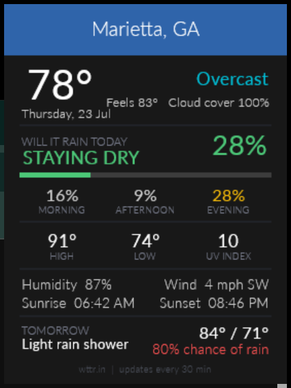
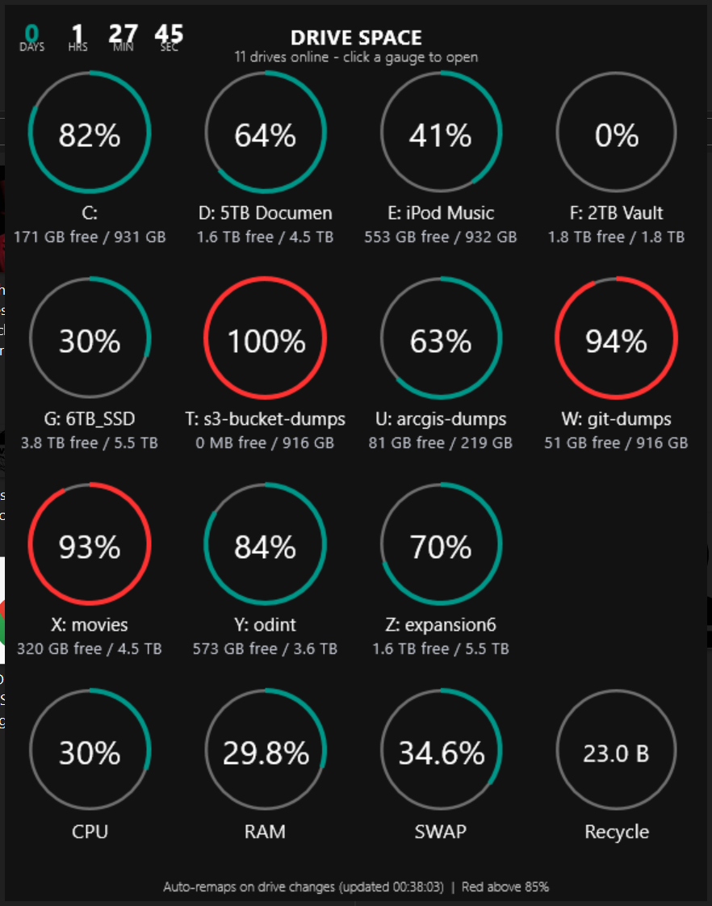
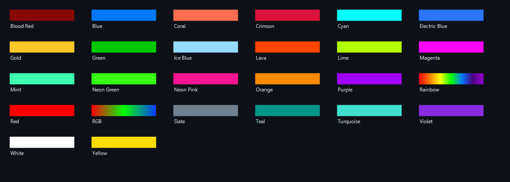
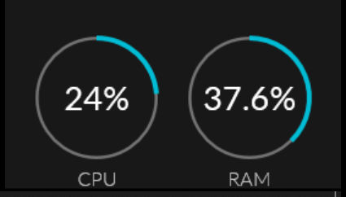
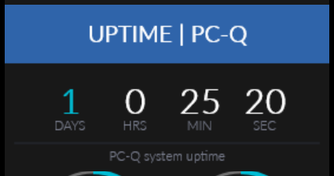
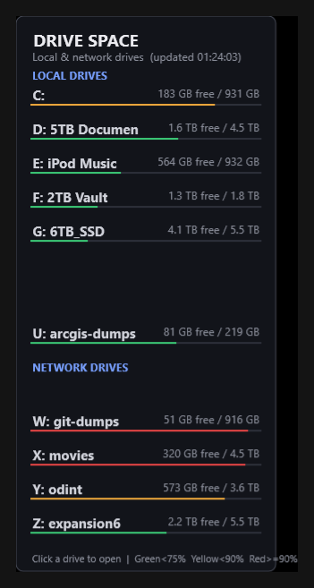

<div align="center">

[](https://www.rainmeter.net/)
[](https://github.com/rainmeter/rainmeter)
[](#write-a-skin-in-a-text-editor)
[](#why-rainmeter)
[](https://www.rainmeter.net/)

**Your desktop is the biggest screen you own and it is showing a wallpaper.**

Rainmeter puts live, clickable, always-there information on it instead.

**For Linux users:** → [Conky Configuration Repository](https://github.com/Ringmast4r/Conky)

</div>


## Why Rainmeter

Rainmeter has been around since 2001 and is still the best thing on Windows for this. It is free, open source, and about as light as software gets.

**It is just text.** A skin is an `.ini` file. No SDK, no compiler, no build step, no npm. Open it in Notepad, change a number, save, and the widget updates instantly. That is the whole loop.

**It reads anything.** CPU, RAM, disk, network throughput, battery, running processes, folder sizes, Windows performance counters, the registry, any file on disk, and any URL on the internet. If you can get data, you can put it on your desktop.

**It costs nothing to run.** These widgets sit at a few MB of RAM and effectively zero CPU between updates. It is not an Electron app.

**Everything is clickable.** Every element can run a program, open a folder, hit a URL, or fire off a script. Widgets and launchers are the same thing.

**Nothing phones home.** No account, no telemetry, no subscription, no ads. You download it, it runs.


## The Skins (18+ Collections)

| Folder | Description |
|:--|:--|
| **Dark - Weather & System Monitor** | Current weather, rain forecast, CPU/RAM rings, uptime |
| **Simplic - System Monitoring Suite** | Clean system widgets: CPU, RAM, disk, network, weather, time |
| **Illustro - Clean System Widgets** | Minimal system monitoring (clock, disk, network, system, recycle bin) |
| **Illustro Connected - Dashboard** | Unified dashboard experience |
| **World Clock - Global Time Zones** | 25+ city time zones (London, Tokyo, Sydney, New York, etc.) |
| **Divider - Screen Layout Rules (416 variants)** | 16 configs × 26 colors: thin rules for carving up your monitor |
| **Folder Sizes - Drive & Folder Monitor** | E-drive folder size tracker with Lua sorting |
| **Disc Drive Size - Compact Storage Monitor** | Compact list view of local and network drives |
| **Ringmast4r - Advanced Dashboards** | CyberOps dashboard, folder trackers, MAC OUI lookup, social media trackers |
| **Impact - Drive Space Monitor** | Drive usage with color-coded capacity |
| **Hit Me Punk - Drive Space Monitor** | Alternative drive space visualization |
| **Bloody - Drive Space Monitor** | Dark-themed drive space monitor |
| **Creepster - Drive & Network Monitor** | Drive and network status display |
| **SimpleDP - CPU & RAM Gauge** | CPU and RAM usage as rotating gauges |
| **@DriveData - Drive Backend Service** | Background service for drive monitoring (do not load directly) |
| **@Vault - Resource Library** | Shared resources and fonts for all skins |


## Weather Widget




Most weather skins tell you the temperature. The useful question is whether you need to bring a jacket, so this one answers that first.

`WILL IT RAIN TODAY` takes the highest chance of rain across the whole day and turns it into one word and one colour:

| Peak chance | Reads | Colour |
|:--|:--|:--|
| under 30% | STAYING DRY | green |
| 30 to 59% | RAIN POSSIBLE | amber |
| 60% and up | RAIN LIKELY | red |

Underneath, the day is split into **morning / afternoon / evening** so you can see *when* it is coming, each tinted on its own. Then high, low, UV index, humidity, wind, sunrise, sunset, and tomorrow's outlook.

It pulls the `j1` JSON feed from [wttr.in](https://wttr.in) — no API key, no signup, no account. One HTTP request every 30 minutes populates all 34 fields.


## Drive Space Widget



A ring per drive, four to a row, with CPU, RAM and the recycle bin on the end. Rings turn red past 85%. Click any ring to open that drive.

**There are no drive letters anywhere in this skin.** Live drives get packed into numbered slots in alphabetical order, and the skin reads its own geometry — positions, labels, colours, even the background height — out of a generated file. Re-letter a drive, plug in a USB stick, drop a network share, and the grid rebuilds itself with no edits.

The trick is the @DriveData backend:

```
Scheduled Task  →  driveinfo.ps1  →  DriveData.inc  →  @Include in the skins
   every 1 min       does the I/O      plain variables      instant, no I/O
```

A scheduled task runs `driveinfo.ps1` once a minute. It scans all drives, does all the blocking work off in its own process, and writes plain Rainmeter variables. The skins `@Include` that file and do zero drive I/O. Startup went from minutes of hanging to **1.2 seconds**.


## Divider Pack




Thin vertical and horizontal rules for carving a wide monitor into zones. 24 solid colours plus a full-spectrum **Rainbow** and an **RGB** sweep.

The trick is the folder layout. Rainmeter only allows one active `.ini` per config folder, so a single `Divider` folder means picking a colour *replaces* the divider you already had. Instead there are **16 separate configs** — `Vertical1` through `Vertical8` and `Horizontal1` through `Horizontal8` — each holding all 26 colours.

That means you can run eight vertical rules at once, each a different colour, and swap any one of them without touching the others.


## System Monitoring

<p align="center">
  
  
</p>

CPU and RAM as rings, and time since boot broken into days, hours, minutes, seconds.

<p align="center">
  
</p>

Compact drive list view with local and network drives.

## Install

```
1.  Install Rainmeter                    https://www.rainmeter.net/
2.  Copy everything in skins/ into       Documents\Rainmeter\Skins\
3.  Refresh Rainmeter (tray icon, right click, Refresh all)
4.  Right click the tray icon > Skins > pick what you want
```

<div align="center">

### Notes

Skins are plain text. Open one, change a colour, hit refresh, see it immediately. That is the entire appeal — start with one of these and make it yours.

</div>


