<div align="center">


`Windows` [`Rainmeter`](https://www.rainmeter.net/) `Widgets` - Collection of Rainmeter skins for Windows: live desktop widgets for system, network, weather, and media. Linux counterpart: Ringmast4r/Conky

[](https://git.io/typing-svg)

<br>

[](https://github.com/Ringmast4r/Rainmeter)
[](https://github.com/Ringmast4r/Rainmeter/tree/main)

[](https://github.com/Ringmast4r/Rainmeter/stargazers)
[](https://github.com/Ringmast4r/Rainmeter/network/members)
[](https://github.com/Ringmast4r/Rainmeter)
[](https://github.com/Ringmast4r/Rainmeter/commits/main)

</div>

---

<div align="center">

[](https://www.rainmeter.net/)
[](https://github.com/rainmeter/rainmeter)
[](#write-a-skin-in-a-text-editor)
[](#why-rainmeter)
[](https://www.rainmeter.net/)

**Your desktop is the biggest screen you own and it is showing a wallpaper.**

Rainmeter puts live, clickable, always-there information on it instead.

**For Linux users:** → [Conky Configuration Repository](https://github.com/Ringmast4r/Conky)

</div>


<a id="why-rainmeter"></a>
## `> why_rainmeter`

Rainmeter has been around since 2001 and is still the best thing on Windows for this. It is free, open source, and about as light as software gets.

**It is just text.** A skin is an `.ini` file. No SDK, no compiler, no build step, no npm. Open it in Notepad, change a number, save, and the widget updates instantly. That is the whole loop.

**It reads anything.** CPU, RAM, disk, network throughput, battery, running processes, folder sizes, Windows performance counters, the registry, any file on disk, and any URL on the internet. If you can get data, you can put it on your desktop.

**It costs nothing to run.** These widgets sit at a few MB of RAM and effectively zero CPU between updates. It is not an Electron app.

**Everything is clickable.** Every element can run a program, open a folder, hit a URL, or fire off a script. Widgets and launchers are the same thing.

**Nothing phones home.** No account, no telemetry, no subscription, no ads. You download it, it runs.


<a id="the-skins-20-collections"></a>
## `> the_skins_20_collections`

| Folder | Description |
|:--|:--|
| **Top 20 - Process Leaderboard** | Six side-by-side top-20 leaderboards: CPU, memory, swap, disk I/O, GPU (per engine), VRAM |
| **NWModern - Processes** | Dark glass top-20 board: CPU, memory, GPU and GPU memory ranked in four columns, values tinted by load |
| **NetWorks - Processes and Uptime** | Net // Works black-and-white boards: the same top-20 board, an uptime card, a live IP card (IPv4/IPv6, click to copy), live speed, VPN status and Wi-Fi signal cards, with white/yellow/red thresholds and a dark/light toggle |
| **Dark - Weather & System Monitor** | Current weather, rain forecast, CPU/RAM rings, uptime |
| **Simplic - System Monitoring Suite** | Clean system widgets: CPU, RAM, disk, network, weather, time |
| **Illustro - Clean System Widgets** | Minimal system monitoring (clock, disk, network, system, recycle bin) |
| **Illustro Connected - Dashboard** | Unified dashboard experience |
| **World Clock - Global Time Zones** | 25+ city time zones (London, Tokyo, Sydney, New York, etc.) |
| **Divider - Screen Layout Rules (416 variants)** | 16 configs × 26 colors: thin rules for carving up your monitor |
| **Folder Sizes - Drive & Folder Monitor** | E-drive folder size tracker with Lua sorting |
| **Disc Drive Size - Compact Storage Monitor** | Compact list view of local and network drives |
| **Ringmast4r - Advanced Dashboards** | CyberOps dashboard, folder trackers, MAC OUI lookup, social media trackers |
| **Impact - Drive Space Monitor** | Drive usage with color-coded capacity |
| **Hit Me Punk - Drive Space Monitor** | Alternative drive space visualization |
| **Bloody - Drive Space Monitor** | Dark-themed drive space monitor |
| **Creepster - Drive & Network Monitor** | Drive and network status display |
| **SimpleDP - CPU & RAM Gauge** | CPU and RAM usage as rotating gauges |
| **@DriveData - Drive Backend Service** | Background service for drive monitoring (do not load directly) |
| **@Vault - Resource Library** | Shared resources and fonts for all skins |


<a id="weather-widget"></a>
## `> weather_widget`


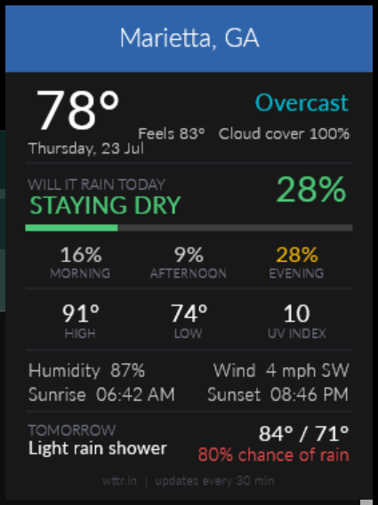

Most weather skins tell you the temperature. The useful question is whether you need to bring a jacket, so this one answers that first.

`WILL IT RAIN TODAY` takes the highest chance of rain across the whole day and turns it into one word and one colour:

| Peak chance | Reads | Colour |
|:--|:--|:--|
| under 30% | STAYING DRY | green |
| 30 to 59% | RAIN POSSIBLE | amber |
| 60% and up | RAIN LIKELY | red |

Underneath, the day is split into **morning / afternoon / evening** so you can see *when* it is coming, each tinted on its own. Then high, low, UV index, humidity, wind, sunrise, sunset, and tomorrow's outlook.

It pulls the `j1` JSON feed from [wttr.in](https://wttr.in) — no API key, no signup, no account. One HTTP request every 30 minutes populates all 34 fields.


<a id="drive-space-widget"></a>
## `> drive_space_widget`

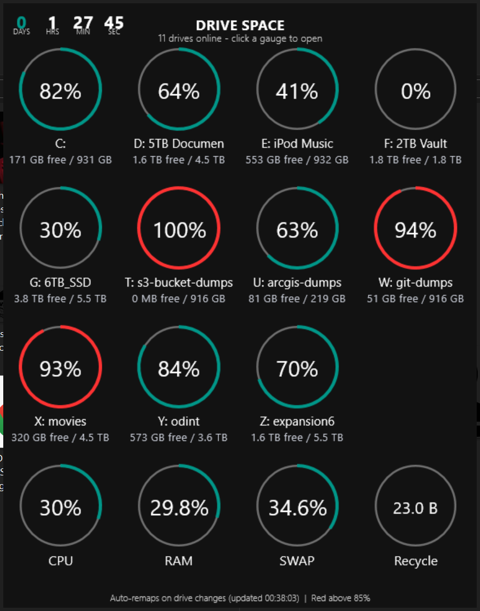

A ring per drive, four to a row, with CPU, RAM and the recycle bin on the end. Rings turn red past 85%. Click any ring to open that drive.

**There are no drive letters anywhere in this skin.** Live drives get packed into numbered slots in alphabetical order, and the skin reads its own geometry — positions, labels, colours, even the background height — out of a generated file. Re-letter a drive, plug in a USB stick, drop a network share, and the grid rebuilds itself with no edits.

The trick is the @DriveData backend:

```
Scheduled Task  →  driveinfo.ps1  →  DriveData.inc  →  @Include in the skins
   every 1 min       does the I/O      plain variables      instant, no I/O
```

A scheduled task runs `driveinfo.ps1` once a minute. It scans all drives, does all the blocking work off in its own process, and writes plain Rainmeter variables. The skins `@Include` that file and do zero drive I/O. Startup went from minutes of hanging to **1.2 seconds**.


<a id="divider-pack"></a>
## `> divider_pack`


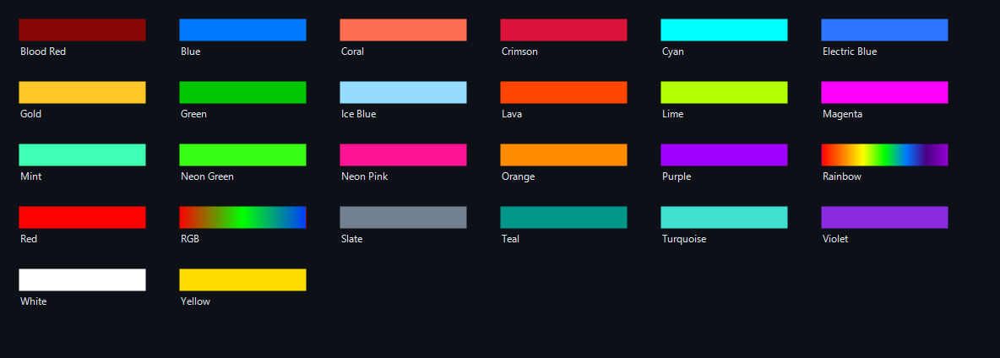

Thin vertical and horizontal rules for carving a wide monitor into zones. 24 solid colours plus a full-spectrum **Rainbow** and an **RGB** sweep.

The trick is the folder layout. Rainmeter only allows one active `.ini` per config folder, so a single `Divider` folder means picking a colour *replaces* the divider you already had. Instead there are **16 separate configs** — `Vertical1` through `Vertical8` and `Horizontal1` through `Horizontal8` — each holding all 26 colours.

That means you can run eight vertical rules at once, each a different colour, and swap any one of them without touching the others.


<a id="top-20-processes"></a>
## `> top_20_processes`


Task Manager sorts by one column at a time. This skin sorts **every** column at once: six leaderboards side by side, each ranking the 20 processes eating the most of one resource.

| Column | Ranked by | Header shows |
|:--|:--|:--|
| CPU | share of busy time | busy %, plus Task Manager's utility % and the real clock speed |
| Memory | private working set | used / total RAM |
| Swap | commit charge | commit used / commit limit |
| Disk I/O | read + write per second | active time and throughput |
| GPU | the process's busiest engine, named | busiest engine on the card |
| VRAM | dedicated video memory | used / total VRAM |

**Why the CPU can read higher than Task Manager.** Task Manager shows `% Processor Utility`: busy time scaled by how fast the cores are actually clocked against base clock. A chip that is 100% busy but throttled to 2.7 GHz on a 3.6 GHz base reads about 74% there. The skin shows busy time big, with the utility figure and the effective clock underneath, so a throttling CPU stands out.

**Why the GPU is counted per engine.** A GPU has separate 3D, video encode, video decode, copy and compute engines, so adding them up overstates the load. Like Task Manager, each process gets its busiest engine and the header gets the busiest engine on the card. UsageMonitor can only sum, so `GpuBoard.lua` reads the raw per-engine rows and names the PIDs from a cached `tasklist`.

Everything comes from the UsageMonitor plugin that ships with Rainmeter, one perf-counter thread per category, so 120 ranked rows cost well under 1% CPU. Colours and fonts live in `@Resources\Variables.inc`. The layout, row count and column list are generated by `@Resources\generate.py`: rerun it after changing hardware, then refresh. Inter is bundled under the SIL Open Font License.

<a id="nwmodern"></a>
## `> nwmodern`


<p align="center">
  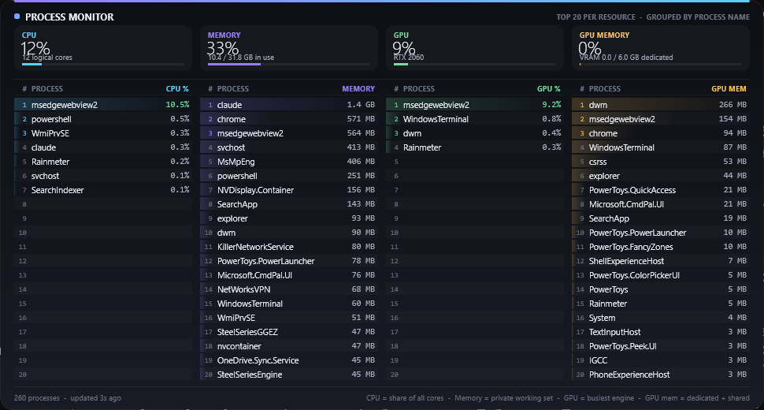
</p>
<p align="center">
  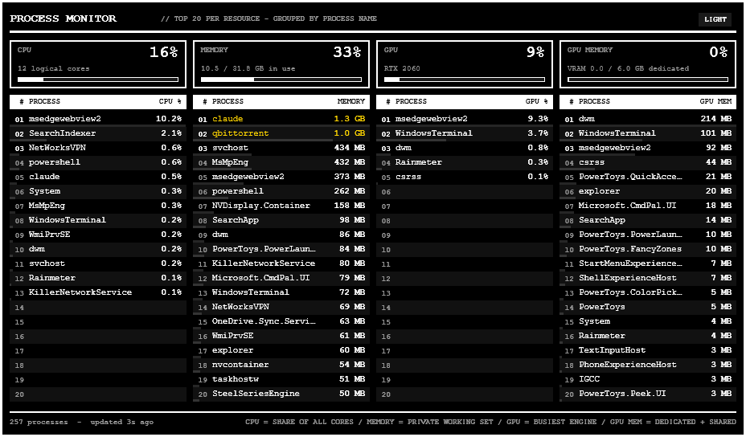
</p>
<p align="center">
  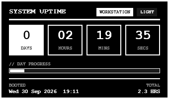
  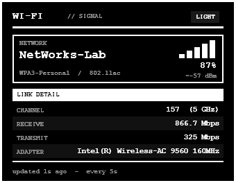
</p>
<p align="center">
  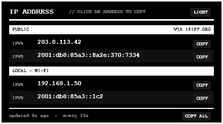
  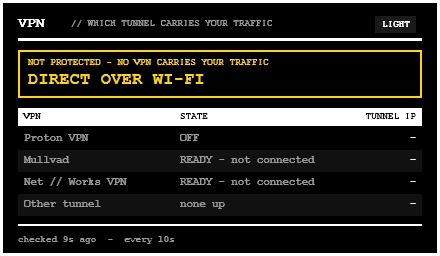
</p>
<p align="center">
  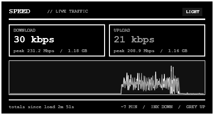
</p>

<sub>Screenshots are taken in screenshot mode: the IP card shows documentation-only addresses (203.0.113.0/24, 2001:db8::/32), and the Wi-Fi and Uptime cards show placeholder names.</sub>

There are two top-20 boards, in two skin folders, built to run side by side so you can compare the styles live:

| Folder | Skin | Look |
|:--|:--|:--|
| `NWModern - Processes` | `Processes` | Dark glass, one accent colour per resource, CPU and GPU values tinted by load |
| `NetWorks - Processes and Uptime` | `Processes` | The Net // Works house style: black and white, Courier New, square 2-3px borders, black table headers. Values step white, yellow, red at thresholds you set in the INI. Has a dark/light toggle |
| `NetWorks - Processes and Uptime` | `Uptime` | Days, hours, minutes and seconds as stat boxes, plus day progress, boot time and total hours. Same house style and toggle |
| `NetWorks - Processes and Uptime` | `IP` | Live public and local IPv4 / IPv6. Click an address to copy it, or COPY ALL. Looks up every 15 s, so a VPN switch shows within seconds, and a changed address turns yellow for a minute. Public addresses come from ipify.org. If IPv6 is missing it says why (tur| `NetWorks - Processes and Uptime` | `Speed` | Live download and upload in Mbps on the best-route adapter, a ~7 minute graph, peaks and data used since load. Shows current traffic, not a speed test |
| `NetWorks - Processes and Uptime` | `VPN` | Which VPN is connected (Proton, Mullvad, Net // Works or any other tunnel) and whether it actually carries your traffic, judged by the default route. A yellow NOT PROTECTED banner when traffic goes out directly |
| `NetWorks - Processes and Uptime` | `WiFi` | Network name, signal strength as bars, % and approximate dBm (yellow below 60%, red below 35%, editable), security, radio type, channel and band, link rates |
ned off on the adapter, or no IPv6 route) |

Each board shows four columns at once, and each column ranks the 20 processes using the most of one resource. Processes are grouped by name, the way Task Manager groups them:

| Column | Measured as |
|:--|:--|
| CPU | change in process CPU time / elapsed time / logical cores (same math as Task Manager) |
| Memory | private working set (Task Manager's "Memory" column) |
| GPU | the process's busiest GPU engine, not the sum of all engines |
| GPU mem | dedicated + shared GPU memory committed (Task Manager's "GPU memory") |

**How it gets the data.** `@Resources\Scripts\Collect.ps1` reads the Windows performance counters through WMI every 2 seconds and writes `@Resources\Data\procs.txt`. `Procs.lua` sorts that file four ways and draws the boards. The collector starts hidden when a board loads. Each skin folder runs its own collector, and a mutex stops duplicates within a folder. It shuts itself off about 20 seconds after the last board closes, because it watches a heartbeat file the boards keep updating. Nothing is left running in the background.

**Screenshot mode.** Before taking screenshots, run `[!SetVariable Demo 1]` on the IP, Wi-Fi and Uptime cards (or add `Demo=1` under `[Variables]` and refresh). They then show documentation-only IP addresses and placeholder network and computer names, so nothing real leaks. Set it back to `0` afterwards.

**Dark/light.** Click the `LIGHT` / `DARK` button in the corner of the Net // Works skins. Both palettes live in `@Resources\Themes\`. The 3,000-line board INIs are generated: edit `@Resources\Tools\generate_processes.py` in that folder, rerun it, then refresh.

<a id="system-monitoring"></a>
## `> system_monitoring`

<p align="center">
  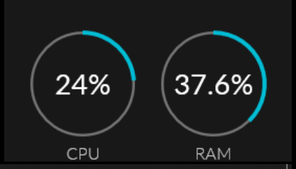
  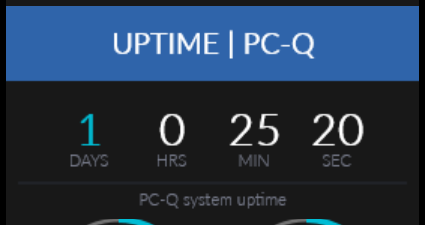
</p>

CPU and RAM as rings, and time since boot broken into days, hours, minutes, seconds.

<p align="center">
  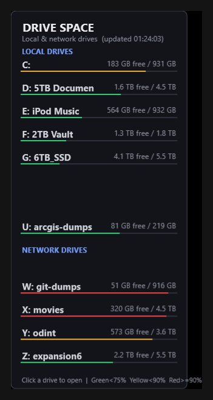
</p>

Compact drive list view with local and network drives.

<a id="install"></a>
## `> install`

```
1.  Install Rainmeter                    https://www.rainmeter.net/
2.  Copy everything in skins/ into       Documents\Rainmeter\Skins\
3.  Refresh Rainmeter (tray icon, right click, Refresh all)
4.  Right click the tray icon > Skins > pick what you want
```

<div align="center">

### Notes

Skins are plain text. Open one, change a colour, hit refresh, see it immediately. That is the entire appeal — start with one of these and make it yours.

</div>

---

<div align="center">


</div>
